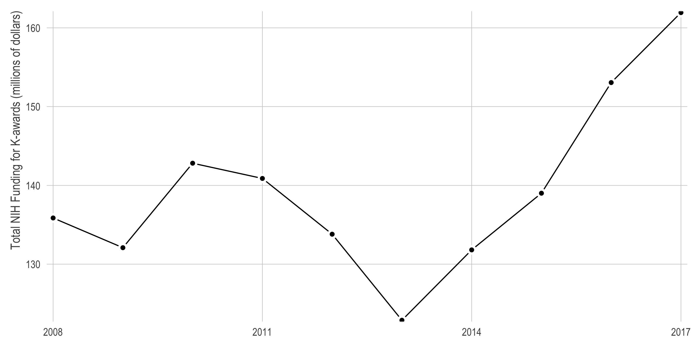
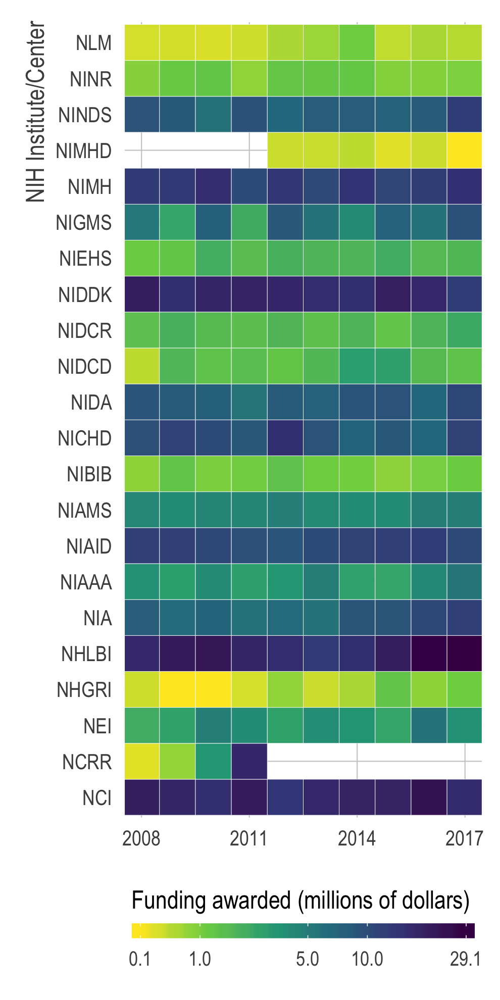
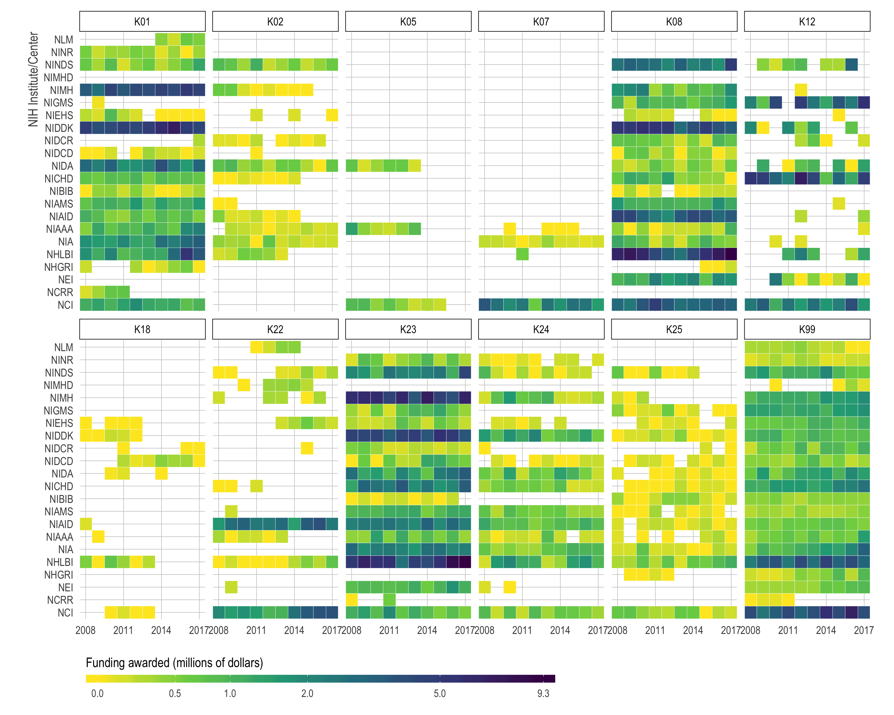
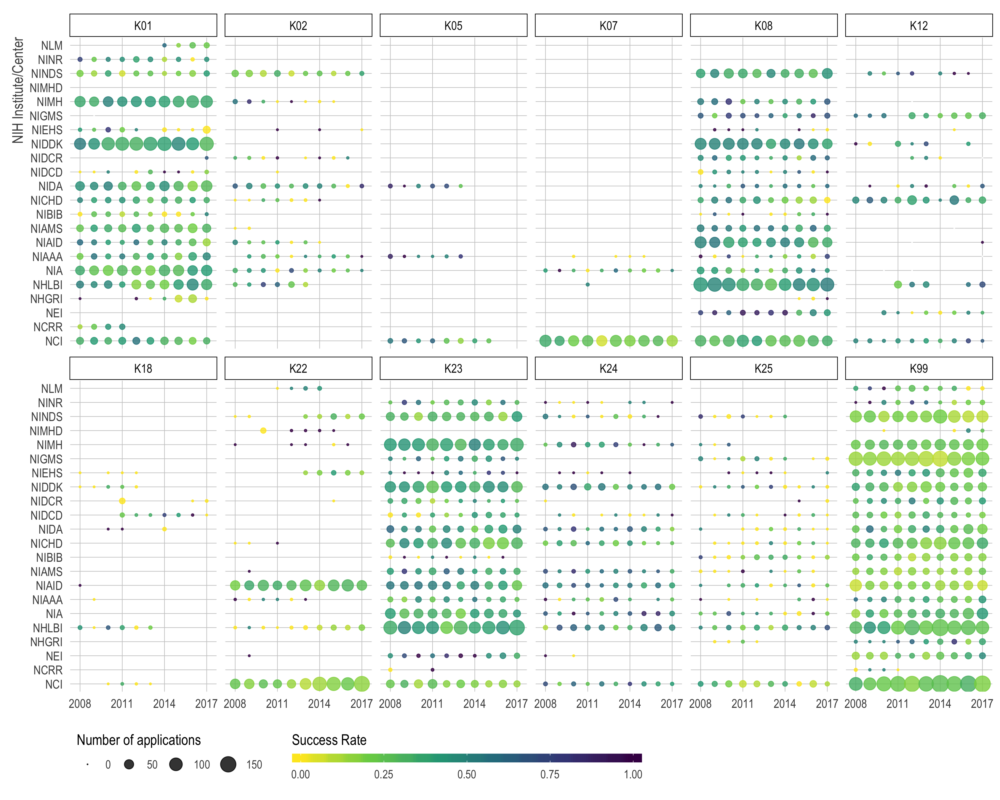
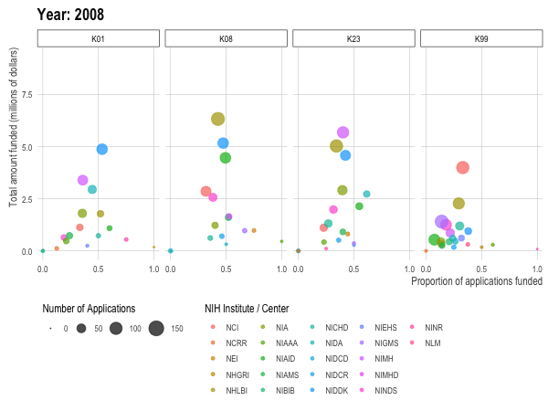

<!-- README.md is generated from README.Rmd. Please edit that file -->

# k\_success\_rates

Some quick exploratory looks at the [NIH Success Rates
data](https://report.nih.gov/success_rates/) for early career awards
(i.e,. “K-awards”).

## Warning

This was started fairly quickly over a lunch break — it almost certainly
has errors.

## Future plans

None for now but as I get more serious about applying, I might
eventually turn this into a Shiny app and do more thorough analyses.
You’re welcome to fork and do this if you’re
interested.

# Plots

## How much has the NIH awarded in early career grants over time?

## How much has been awarded by institute / center over time?

## How much has been awarded by all those things *and* funding mechanism?

## How many applicants and what is the success rate for K-awards?

## But can you use `gganimate`?

